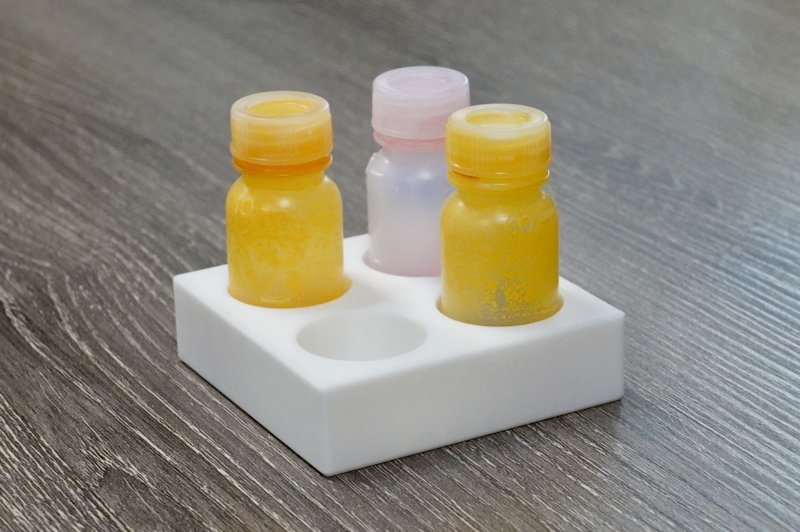
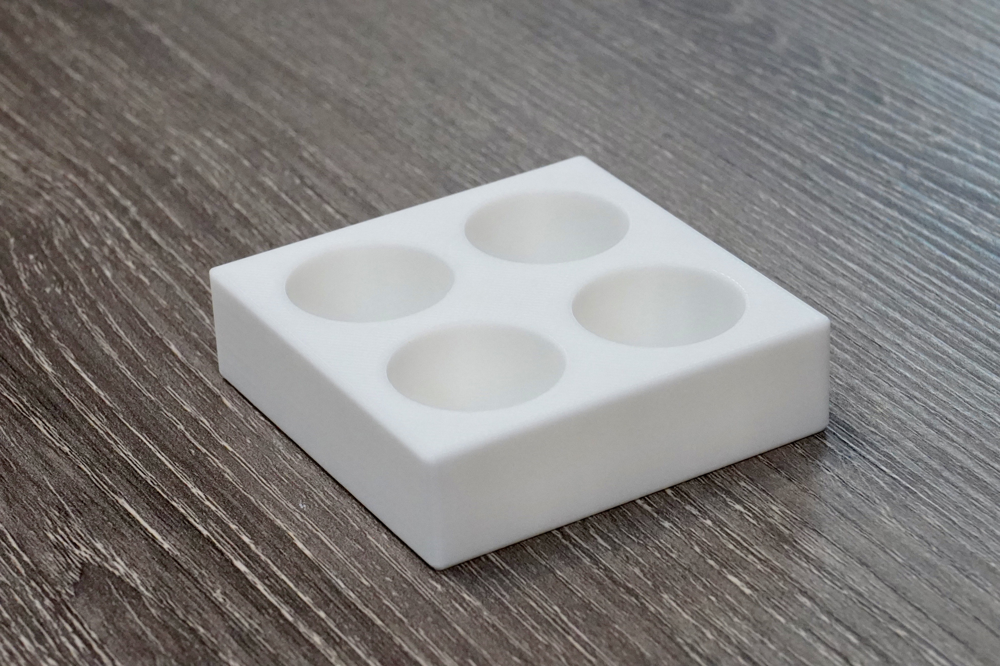
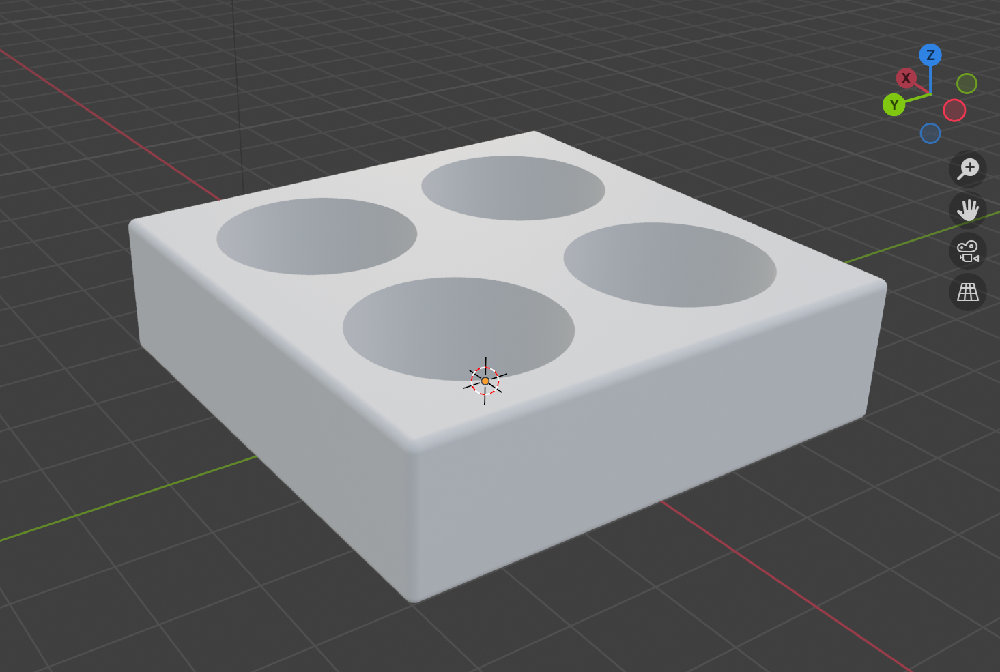
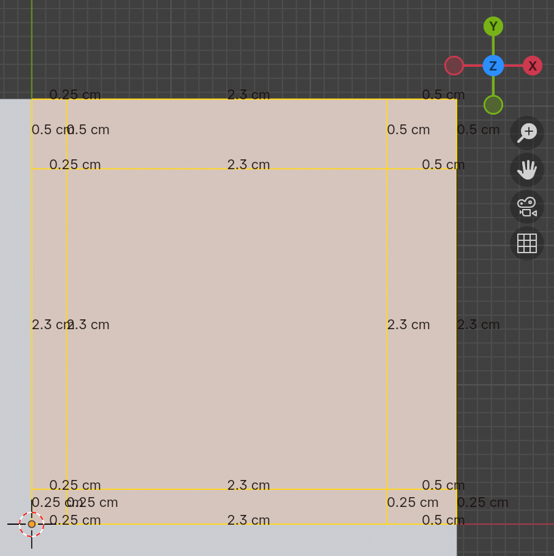
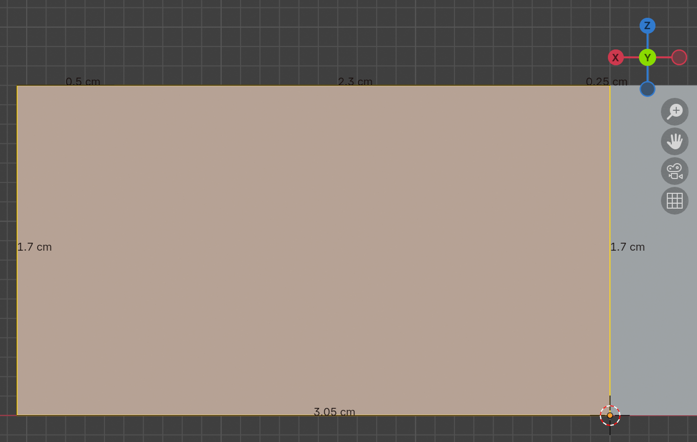
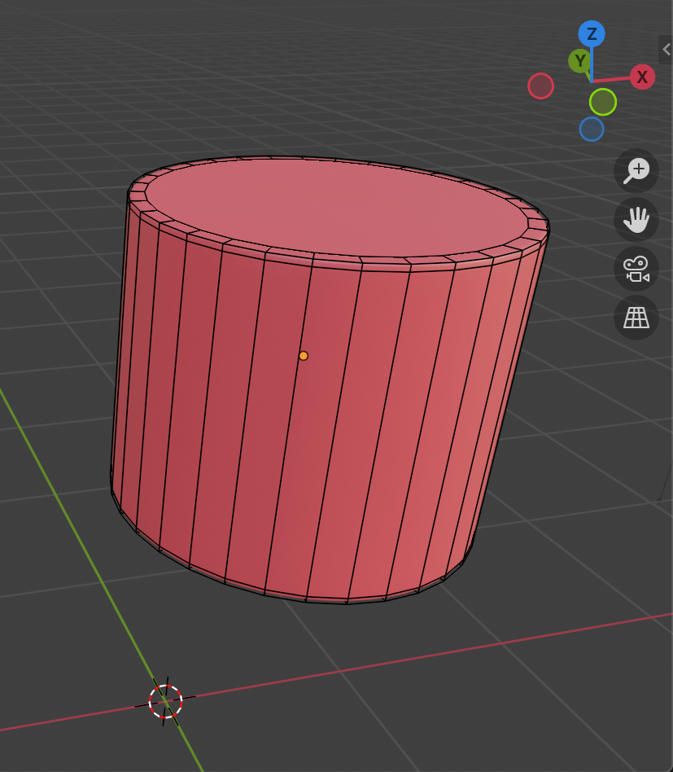
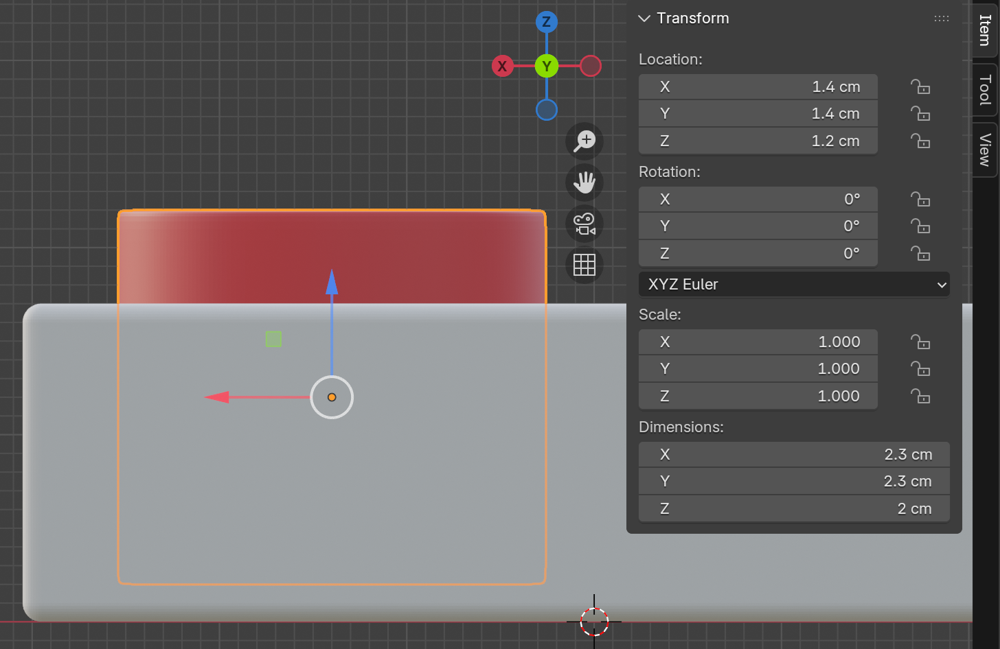
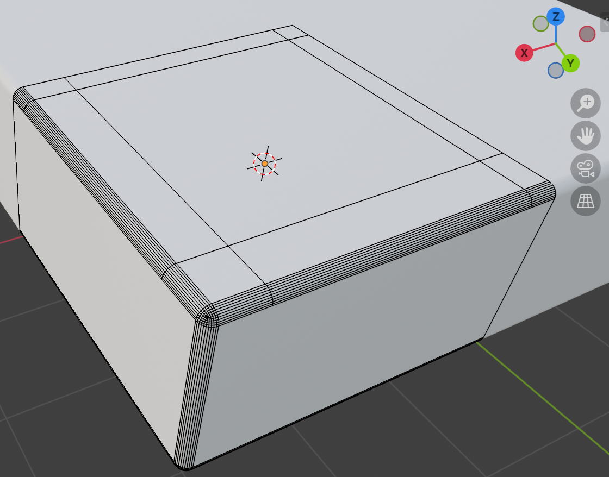
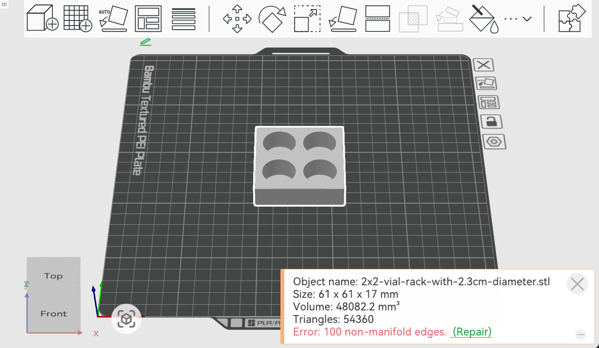

# 2x2 Vial Rack (for vials with 2.1cm diameter)

A tiny 2x2 vial rack with 2.3cm diameter holes, designed to hold up to 4 vials, each with a 5cm height and 2.1cm diameter (cylindrical body).

If using STL, make sure to repair geometry in the slicer before printing.

 

> Photo courtesy of [@j1soon](https://github.com/j1soon).

## Software and Hardware

- Blender 4.5.5 LTS
- Bambu Studio 2.4.0.70
- 3D Printer: Bambu Lab P2S
- Filament: Bambu PLA Basic (Jade White)

## Modeling Steps

### Base Rack (Cuboid only)

First, create a cuboid (Z+ Up) with 2.3cm diameter holes with 0.5cm margin, and 1.5cm hole height and 0.2 bottom layer. After creating one quadrant, mirror it along the X and Y axes to complete the 2x2 rack.

 

Steps to create the edges (for sanity check):

- In `Edit mode (Tab)`,
- Use `Loop Cut (Ctrl+R)` or
- In `Edges mode (2)`, select two edges and `Right-click Subdivide`.
- Type in numbers to specify the offset.
- Optionally, if a vertex exists at the starting point, you can use `Knife (K)` select the starting point, press `A` twice to constrain the angle, and then click the ending point and press `Enter` to create the edge.

### Vial Holes

 

Steps to create the vial holes with smooth edges:

- In `Edit mode (Tab)`,
- In `Face mode (3)`, select the top and bottom faces and `Inset Faces (I)` and type `0.1`.
- `Alt + Left-click` the side faces and `Inset Faces (I)` and type `0.1`.
- Back to `Object mode (Tab)`, select the cylinder and press `Ctrl + 3` to apply the subdivision surface modifier.
- The cylinder should float above the ground for 0.2cm height.
- Then, hide it from the viewport (`H`).

References:

- [Blender - A better cylinder - #5 Subdivision Surface Modelling in Blender.](https://youtu.be/pWOh9cWwYqU)

### Base Rack

- Add Boolean modifier with difference operation to subtract the vial holes from the base rack.
- Add Mirror modifier to mirror the base rack along the X and Y axes. Make sure to set origin
- Select all side edges, apply `Bevel (Ctrl + B)`, type `0.1`, and mouse wheel to 10 faces.

### Export

`File > Export > STL (.stl)` and set Scale to `10.0`.

## Printing Notes

Open STL file in Bambu Studio, and click `Repair` to fix the geometry. Then proceed with the default printing settings.

## STL Files

- [Download on Printables](https://www.printables.com/model/1513800-2x2-vial-rack-for-vials-with-22cm-diameter)
- [Download on MakerWorld](https://makerworld.com/en/models/2110680-2x2-vial-rack-for-vials-with-2-2cm-diameter)

## Source Files

The model should be straightforward to recreate using the steps above. If you would like the original `.blend` source files, please [open an issue](https://github.com/j3soon/3d-modeling-and-printing/issues).
