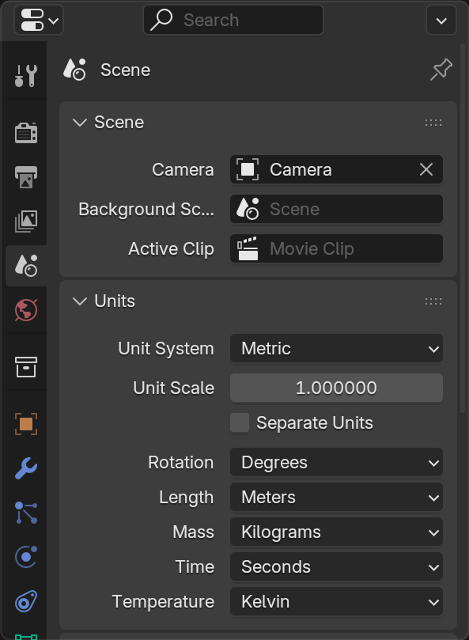
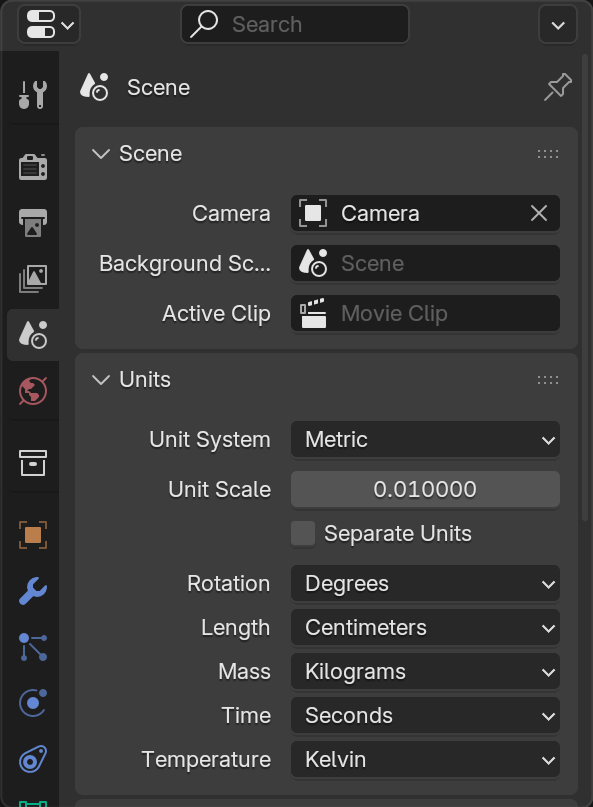
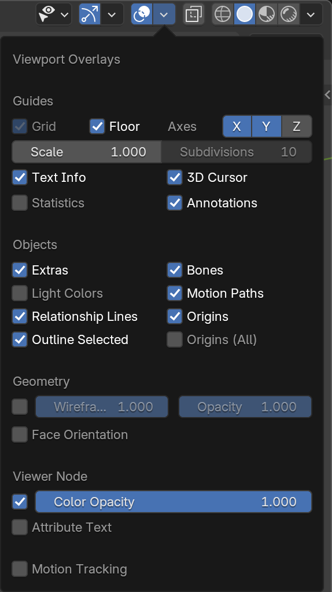
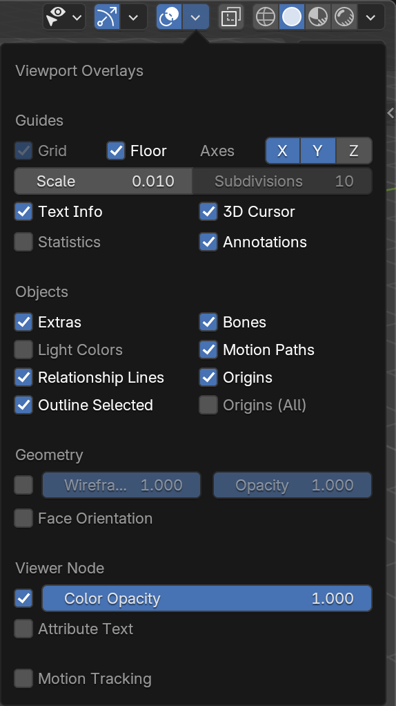
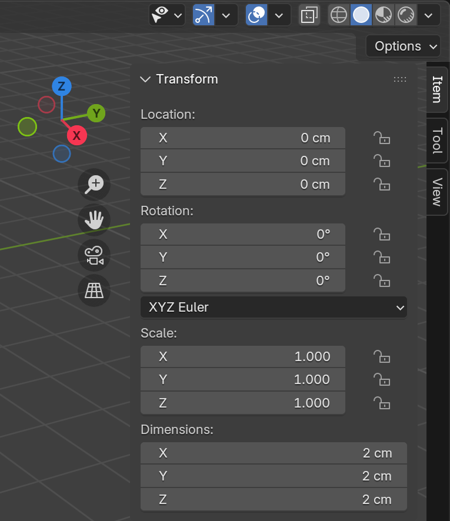
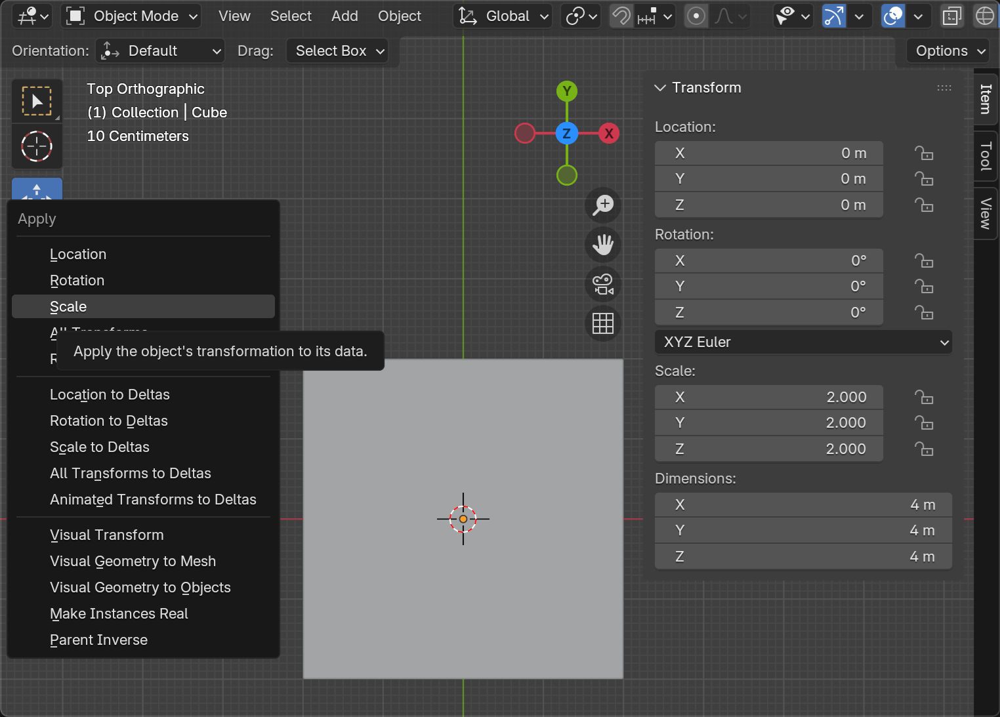

# 3D Modeling and Printing

3D modeling and printing notes and projects.

## Blender Settings

After creating a new Blender project, change the units:

- `Properties > Scene > Units`, change `Unit Scale` to `0.01` and `Length` to `Centimeters`.
- `Viewport Overlays`, change `Scale` to `0.01`.

| Before | After |
|--------|-------|
 | 
 | 

You may also want to select `Viewport Shading: Material Preview` at the top-right corner of the 3D viewport, in case you want to color objects for better visualization.

After resizing any object, always apply the scale to maintain correct measurements. Use `Ctrl+A > Apply > Scale`. Press `N` to toggle the Transform tab.

