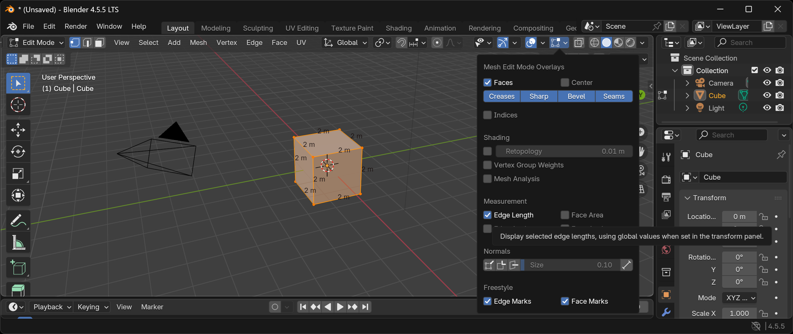

# 3D Modeling and Printing

3D modeling and printing notes and projects.

## Blender Settings

After creating a new Blender project, change the units:

- `Properties > Scene > Units`, change `Unit Scale` to `0.01` and `Length` to `Centimeters`.
- `Viewport Overlays`, change `Scale` to `0.01`.

| Before | After |
|--------|-------|
 | 
 | 

You may also want to select `Viewport Shading: Material Preview` at the top-right corner of the 3D viewport, in case you want to color objects for better visualization.

After resizing any object, always apply the scale to maintain correct measurements. Use `Ctrl+A > Apply > Scale`. Press `N` to toggle the Transform tab.

and visualize edge lengths as overlays in viewport edit mode.

## Other CAD Tools

CAD tools are more suitable for mechanical design compared to Blender, which is more focused on artistic modeling.

Some CAD tools that are potentially useful for 3D modeling:

- [FreeCAD](https://www.freecad.org/) - Free and [open source](https://github.com/FreeCAD/FreeCAD).
- [Autodesk Fusion 360](https://www.autodesk.com/products/fusion-360/overview) - Free version for [personal use](https://www.autodesk.com/products/fusion-360/personal).
- [Tinkercad](https://www.tinkercad.com/) - Free and browser-based, friendly for beginners, but may not be suitable for complex models.
- [Onshape](https://www.onshape.com/en/) - Browser-based, free version requires opening designs to the public.
- [Solidworks](https://www.solidworks.com/) - No free version.

## Suggested Prints

Useful print:

- [Bambu Bed Scraper](https://makerworld.com/en/models/12703-bambu-bed-scraper#profileId-12705) in PLA. Can also print one in PETG since the PLA version may easily deform due to softness.

Under evaluation (potentially useful but not yet fully tested):

- [Print in Place Tolerance Test](https://makerworld.com/en/models/388977-print-in-place-tolerance-test#profileId-289900) in PLA
  > Useful for testing the tolerance of print in place models, I plan to use it as reference for my future models.
- [AMS 2 Pro Filament Clip](https://makerworld.com/en/models/1327789-ams-2-pro-filament-clip#profileId-1365484) in PETG
  > Works well enough, but the clip insertion is very tight and could be potentially improved.
- [P2S External spool disassemble tool](https://makerworld.com/en/models/1917584-p2s-external-spool-disassemble-tool#profileId-2057214) in PLA
  > This is potentially useful for disassembling, unfortunately It doesn't work well with my case.

Unnecessary prints:

- [Purge Bucket - Poop Chute](https://makerworld.com/en/models/109919-purge-bucket-poop-chute-simple-x1c-p1s-p1p#profileId-117399) in PLA
  > This is suggested in [Bambu Lab Academy](https://bambulab.com/en/support/academy/11/course/1035222905371639808/chapter/256) but it's usually unnecessary, since you can often just use spare cardboard boxes from online shopping packages.

## Useful Items

- Vernier caliper - For real world measurements.
- [妙潔 密實袋 (大)](https://pxbox.es.pxmart.com.tw/product/26842) - Just large enough to fit a spool of filament, and can be sealed to keep the filament dry by using desiccant. It should work well for a short-term solution, but not for long-term storage since moisture can still somehow get in.

## Common Bambu Lab References

- [Bambu Lab Wiki](https://wiki.bambulab.com/en/home)
  - [Unboxing and Packing Guide](https://wiki.bambulab.com/en/general/unboxing-guide)
- [Maker World](https://makerworld.com/en)
- [Bambu Studio](https://bambulab.com/en/download/studio)
- [Bambu Lab Academy](https://bambulab.com/en/support/academy)
